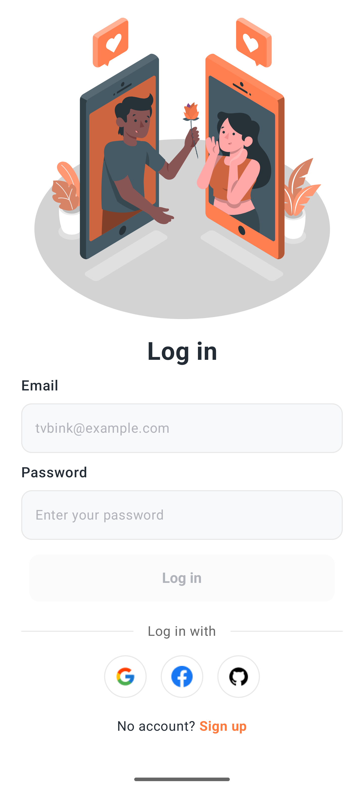
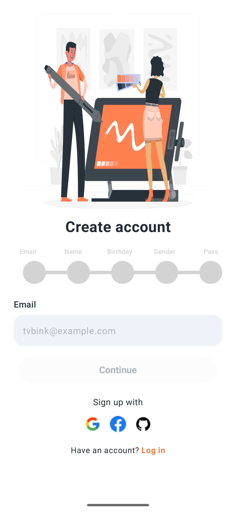
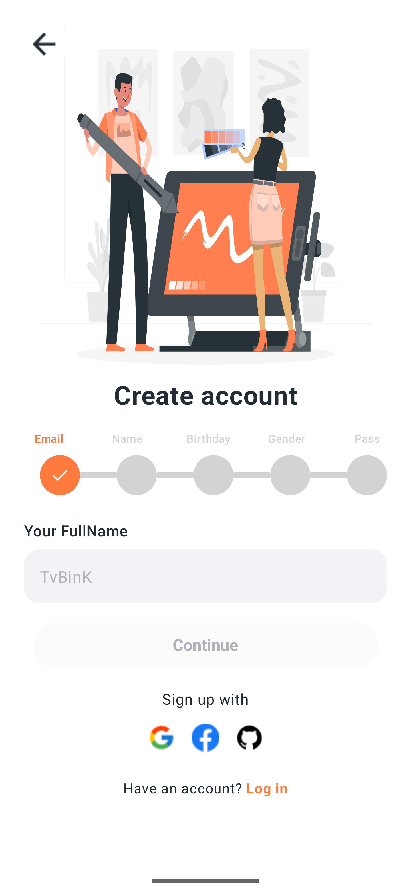
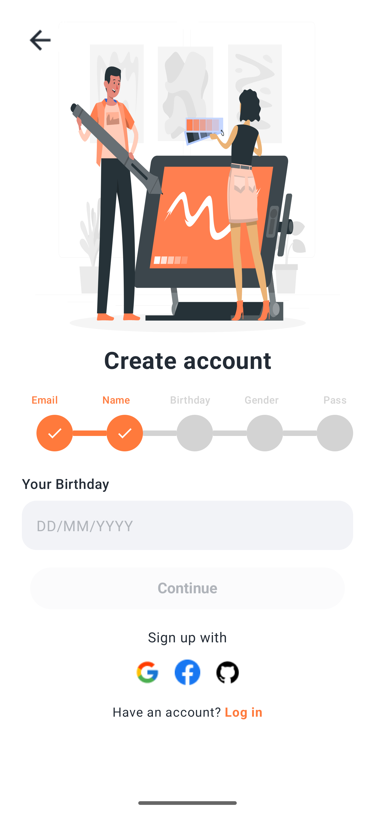
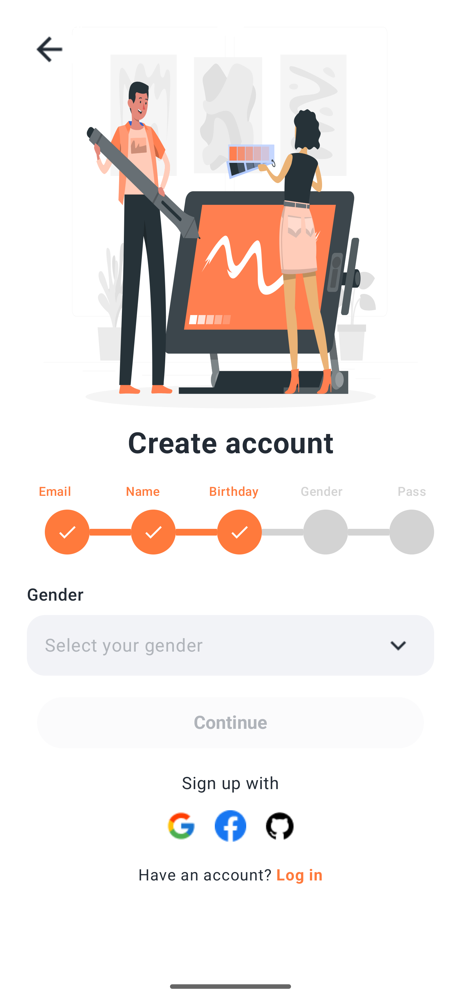
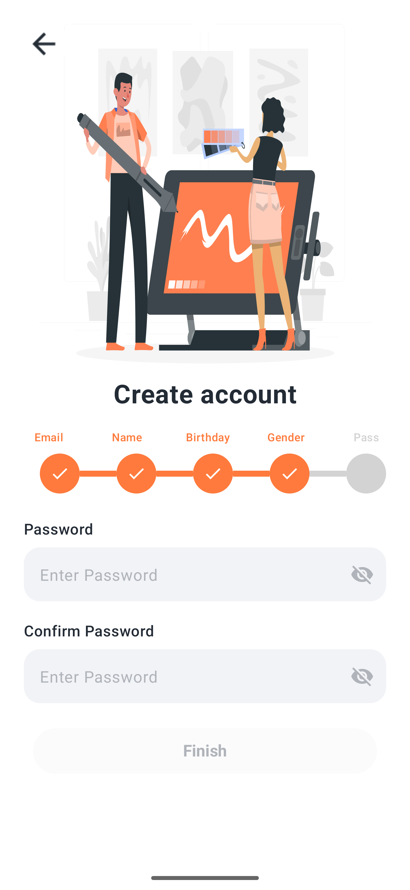
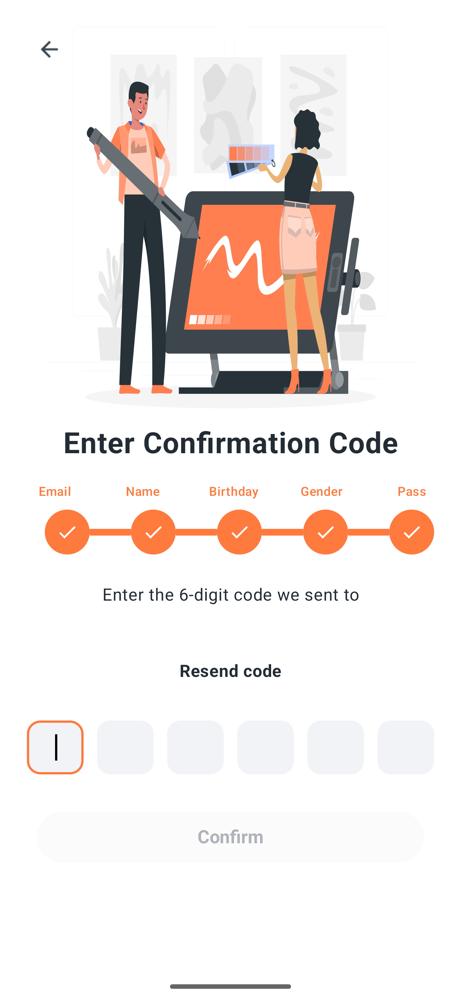

# LearnJetpack - Android App

<p align="center">
  <a href="https://developer.android.com/">
    
  </a>
  <a href="https://kotlinlang.org/">
    
  </a>
  <a href="https://developer.android.com/jetpack/compose">
    
  </a>
</p>

## 📱 Giới thiệu

LearnJetpack là ứng dụng Android được phát triển bằng **Kotlin** và **Jetpack Compose**, tập trung vào việc học và thực hành các tính năng hiện đại của Android development.

## ✨ Tính năng chính

### 🔐 Hệ thống đăng ký/đăng nhập
- **Đăng nhập đa nền tảng**: Google, Facebook, GitHub
- **Đăng ký từng bước**: Email → Tên → Ngày sinh → Giới tính → Mật khẩu
- **Xác thực mã OTP**: Giao diện nhập mã 6 chữ số với animation mượt mà
- **Thanh tiến trình**: Hiển thị các bước đăng ký đã hoàn thành

### 🎨 Giao diện người dùng
- **Material Design 3**: Thiết kế hiện đại theo chuẩn Google
- **Animation mượt mà**: Fade in/out, scale effects
- **Responsive Design**: Tương thích với nhiều kích thước màn hình

## 📸 Screenshots

### 🔑 Màn hình đăng nhập

*Đăng nhập với email/password hoặc social login*

### 📧 Màn hình đăng ký - Email

*Bước đầu tiên: Nhập email để đăng ký*

### 👤 Màn hình đăng ký - Tên

*Bước thứ hai: Nhập họ tên*

### 🎂 Màn hình đăng ký - Ngày sinh

*Bước thứ ba: Chọn ngày sinh*

### ⚧ Màn hình đăng ký - Giới tính

*Bước thứ tư: Chọn giới tính*

### 🔒 Màn hình đăng ký - Mật khẩu

*Bước thứ năm: Tạo mật khẩu*

### 📱 Màn hình xác nhận mã OTP

*Nhập mã xác thực 6 chữ số với giao diện tối ưu*

## 🛠 Công nghệ sử dụng

### Core Technologies
- **Kotlin**: Ngôn ngữ lập trình chính
- **Jetpack Compose**: UI framework hiện đại
- **Material Design 3**: Design system
- **Android Studio**: IDE phát triển

### Architecture & Libraries
- **MVVM Pattern**: Model-View-ViewModel
- **Navigation Compose**: Điều hướng màn hình
- **State Management**: Compose State
- **Animation**: Compose Animation

## 📁 Cấu trúc dự án

```
LearnJetpack/
├── app/
│   ├── src/main/
│   │   ├── java/com/example/learnjetpack/
│   │   │   ├── MainActivity.kt
│   │   │   ├── navigation/
│   │   │   │   └── AppNavigation.kt
│   │   │   └── ui/
│   │   │       ├── components/
│   │   │       │   └── StepProgressBar.kt
│   │   │       ├── screens/
│   │   │       │   ├── HomeScreen.kt
│   │   │       │   ├── LoginScreen.kt
│   │   │       │   ├── RegisterScreen.kt
│   │   │       │   ├── RegisterNameScreen.kt
│   │   │       │   ├── RegisterBirthdayScreen.kt
│   │   │       │   ├── RegisterGenderScreen.kt
│   │   │       │   ├── RegisterPasswordScreen.kt
│   │   │       │   └── RegisterConfirmCodeScreen.kt
│   │   │       ├── theme/
│   │   │       │   ├── Color.kt
│   │   │       │   ├── Theme.kt
│   │   │       │   └── Type.kt
│   │   │       └── viewmodels/
│   │   │           └── LoginViewModel.kt
│   │   └── res/
│   │       ├── drawable/
│   │       ├── values/
│   │       └── xml/
├── build.gradle.kts
└── README.md
```
## 📱 Tính năng chi tiết

### 🔐 Hệ thống xác thực
- **Đăng nhập đa nền tảng**: Tích hợp Google, Facebook, GitHub OAuth
- **Đăng ký từng bước**: Quy trình đăng ký được chia thành 5 bước rõ ràng
- **Xác thực email**: Gửi mã OTP qua email
- **Bảo mật mật khẩu**: Mã hóa và validation mật khẩu

### 🎨 Giao diện người dùng
- **Material Design 3**: Tuân thủ design guidelines mới nhất
- **Animation mượt mà**: Transition giữa các màn hình
- **Responsive**: Tương thích với tablet và phone
- **Accessibility**: Hỗ trợ người dùng khuyết tật

### 📊 Thanh tiến trình
- **StepProgressBar**: Hiển thị tiến độ đăng ký
- **Visual feedback**: Người dùng biết đang ở bước nào
- **Interactive**: Có thể quay lại các bước trước

### 🔢 Input mã OTP
- **6-digit code**: Nhập mã 6 chữ số
- **Auto-focus**: Tự động chuyển sang ô tiếp theo
- **Visual feedback**: Border highlight khi focus
- **Keyboard optimization**: Chỉ hiển thị bàn phím số

<div align="center">
  <sub>Made with ❤️ by [Your Name]</sub>
</div> 